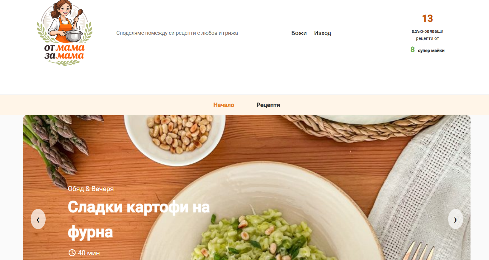
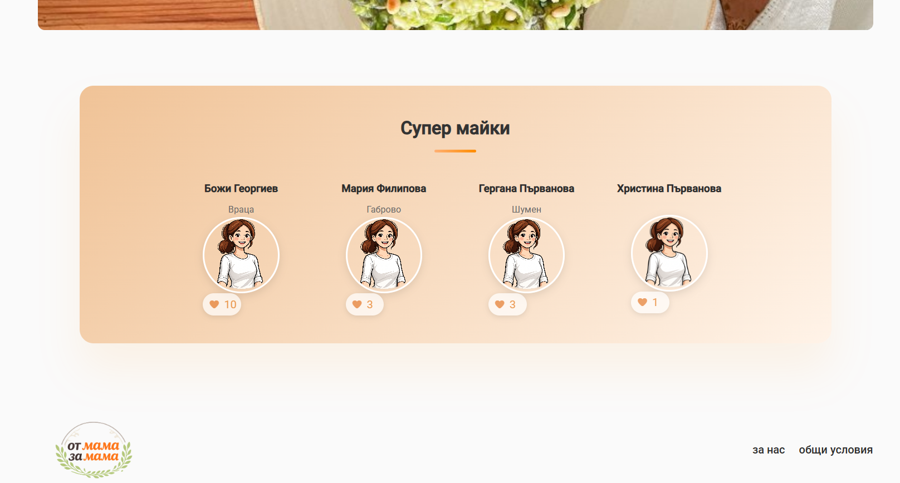
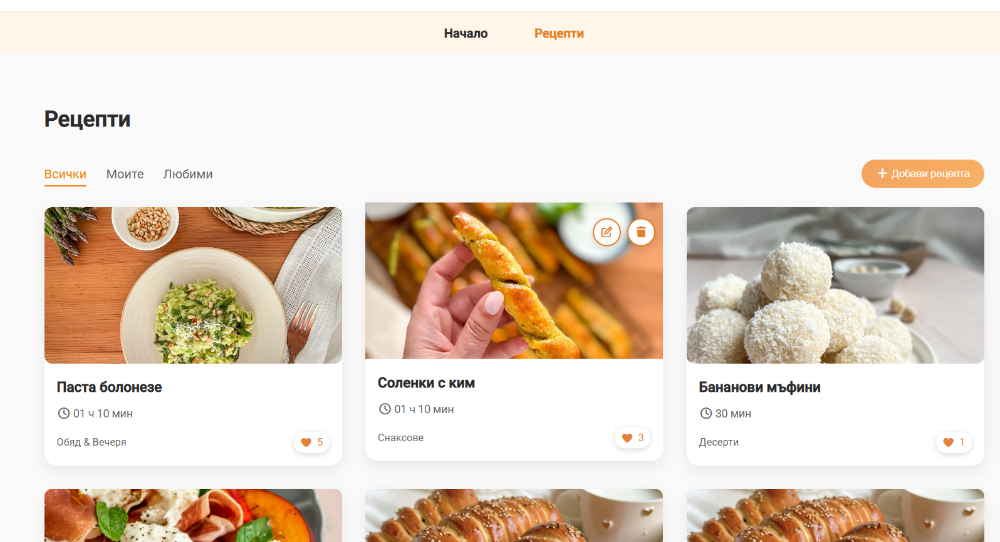
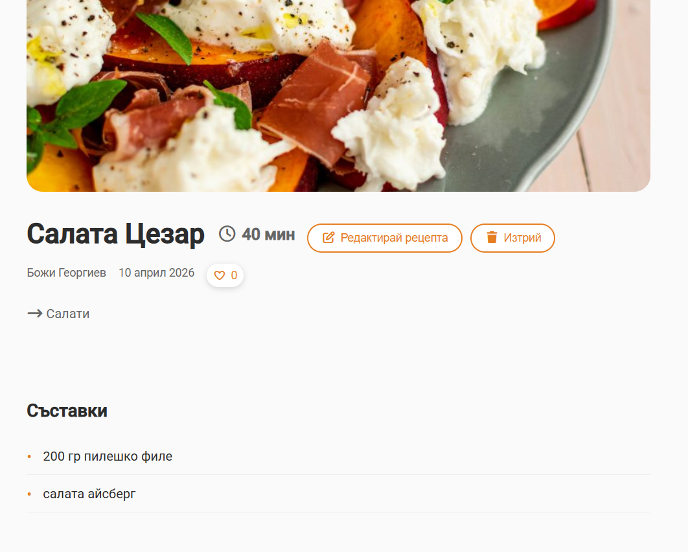
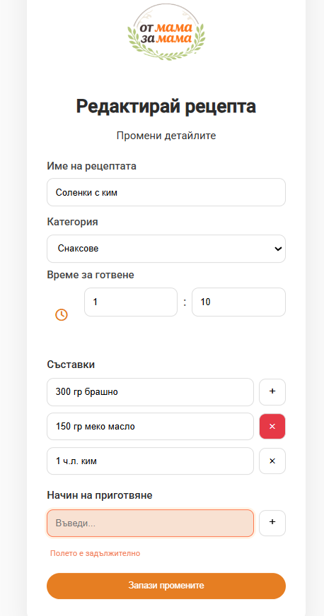
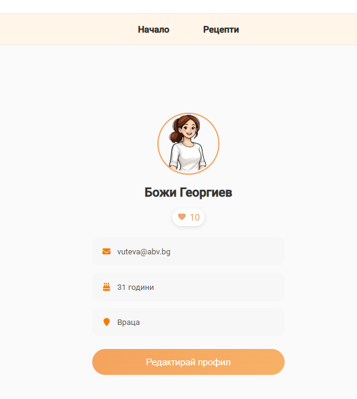
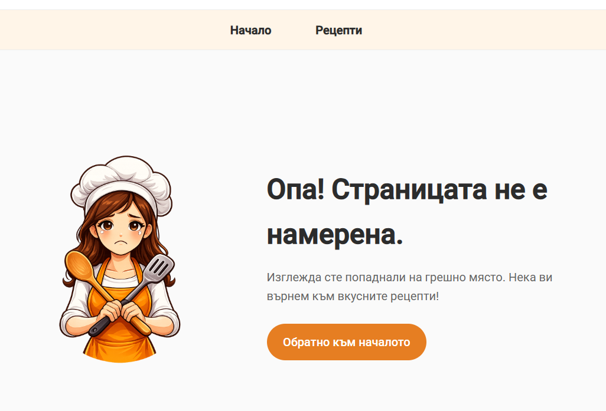

# FromMomToMom (Functional Guide)

## Application Purpose

This application is a recipe-sharing platform designed specifically for mothers to share their cooking inspirations, ideas, and whole family favorite meals.
It allows users to create, browse, and interact with recipes in a simple and user-friendly environment.

The main goal of the platform is to build a small community where users can inspire each other through food.

---

## Main User Flows

### Guest Users

* Can browse all recipes
* Can view recipe details
* Can see the number of favorites of every recipe (likes)
* Cannot create, edit, delete or favorite recipes

---

### Registered Users

* Can register and log into the system
* Can create new recipes
* Can edit and delete their own recipes
* Can favorite / unfavorite recipes
* Can view their own recipes
* Can view their favorite recipes
* Can see total favorites collected

* If a user navigates to an invalid URL, they are redirected to a dedicated **404 Page Not Found** screen.
---

###  Profile Flow

* User can view profile information
* User can see total favorites across their recipes
* User can edit profile data (without email address)

---

## Core Features

### Recipes Management

* Create recipe with:
  * Name
  * Category (list of predefined categories)
  * Cooking time (hours: minutes)
  * Ingredients (dynamic inputs)
  * Preparation steps (dynamic inputs)
* Edit and delete own recipes
* View all recipes in a list

### Dynamic Inputs (Ingredients & PreparationSteps)

The application provides dynamic input fields for ingredients and preparation steps.
* Users can add multiple ingredients and steps dynamically
* New input fields are created on demand
* Users can remove fields if needed
* This is implemented through a reusable dynamic list component

This improves user experience by allowing flexible recipe creation without predefined limits.

---

### Favorites System

* Users can like/unlike recipes
* Each recipe shows a total number of favorites
* Favorite state is visualized with a heart icon:
  * Filled → liked
  * Outline → not liked
* Favorites update instantly (optimistic UI)

---

### Top Users (Super Mamas)

* Displays top 5 users based on total favorites received on their recipes
* Shows:
  * Name
  * Profile picture (autogenerated and same for all user)
  * City (if applicable)
  * Total favorites
* Read-only visualization (no interaction)

---

### Statistics

* Displays total number of:
  * Recipes
  * Registered users
* Updates dynamically when:
  * New user registers
  * Recipe is created or deleted
    
###  Latest Recipes Banner

On the home page, the application displays a banner with the **latest 5 added recipes**.
* They are displayed visually as a highlighted section
* Each item is clickable and navigates to the recipe details page

This feature helps users quickly discover the newest content on the platform.
The latest recipes are retrieved via a dedicated API endpoint with a limit parameter.

### Additional Pages

The application includes several informational and utility pages to improve user experience:

* **About Page**
  Provides information about the purpose of the platform and its mission – connecting mothers through shared cooking inspiration.

* **Terms Page**
  Contains basic terms of use and guidelines for using the platform.

* **Page Not Found (404)**
  A fallback page that is displayed when the user navigates to a non-existing route.
The 404 page provides navigation options to return to the main recipes page.

### Category-Based Images

Each recipe is displayed with a default image based on its selected category.
* The system automatically assigns an image depending on the recipe category
* This ensures consistent visual presentation even when users do not upload custom images
* Improves user experience by providing clear visual differentiation between recipe types
  
This is implemented through a custom pipe that maps recipe categories to predefined images.


---

### Authentication

* Register and login functionality
* Session-based authentication
* Protected actions for logged-in users only

---

## User Interaction

Users interact with the system through:

* Clicking on recipe cards to view details
* Using buttons for:
  * Create
  * Edit
  * Delete
  * Favorite
* Filling forms with validation:
  * Required fields
  * Custom validation (e.g. cooking time cannot be 0:00)
* Navigating via routing (tabs like All / Mine / Favorites)

Visual feedback includes:
* Error messages for invalid inputs
* Disabled states for unauthorized actions
* Dynamic UI updates after actions (no page reload required)

---

## Summary

The application provides a complete user experience for:
* Creating and managing recipes
* Interacting through favorites
* Viewing community statistics and top contributors

It demonstrates core Angular concepts such as:

* Components
* Services
* Reactive Forms
* Routing
* State management (signals)
* Reusable UI components

##  Screenshots

###  Home Page
Highlights the latest 5 added recipes. Each item is clickable and opens the recipe details page.
Displays total number of recipes and registered users, updated dynamically.


###  Top Users
Shows the top 5 users ranked by total favorites received on their recipes.


### Recipe List
Displays all available recipes with basic information, and provides quick access to details, edit and delete for logged-in users.
Users can like and unlike recipes. The heart icon updates dynamically based on the user's interaction.


###  Recipe Details
Shows full recipe information, including ingredients, preparation steps, author, and cooking time. 
Users can like and unlike recipes. The heart icon updates dynamically based on the user's interaction.


### Edit Recipe
Users can create/edit recipes and dynamically add or remove ingredients and preparation steps.


###  Profile Page
Displays user information along with total favorites collected from their recipes.


### Page not found
Displayed when the user navigates to a non-existing route, with an option to return to the main page.


# Setup Guide

## Installation

### 1. Clone the repositories

Frontend:

```
git clone https://github.com/daydreamdreamer/from-mom-to-mom.git
```

Backend:

```
git clone https://github.com/daydreamdreamer/from-mom-to-mom-backend.git
```

---

### 2. Install dependencies

Frontend:

```
cd from-mom-to-mom
npm install
```

Backend:

```
cd from-mom-to-mom-backend
npm install
```

---

## 🔗 Backend Connection

The frontend communicates with a REST API built with Node.js and Express.

* Base API URL:

```
http://localhost:3000/api
```

* Main features connected to backend:

  * Authentication
  * Recipes CRUD
  * Favorites system
  * Statistics
  * Top users aggregation

---

## Project Repositories

Frontend:
https://github.com/daydreamdreamer/from-mom-to-mom

Backend:
https://github.com/daydreamdreamer/from-mom-to-mom-backend

